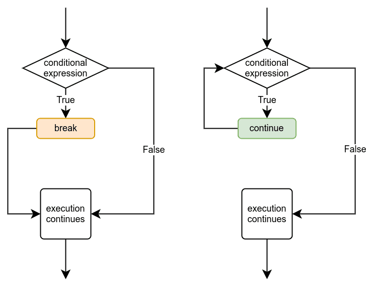

<style>
.exercici {
  position: relative;
  border-radius: 12px;
  background: #fff8e1;
  padding: 1.2em;
  margin: 1em 0;
  box-shadow: 0 4px 8px rgba(0,0,0,0.15);
  border-left: 6px solid #ff9800;
  font-size: 1.1em;
}

.exercici::before {
  content: "Exercici";
  position: absolute;
  top: -10px;
  right: -10px;
  background: #ff9800;   /* verd */
  color: white;
  padding: 0.2em 0.6em;
  border-radius: 12px;
  font-size: 0.85em;
  font-weight: bold;
}


section::after {
  content: attr(data-marpit-pagination) '/' attr(data-marpit-pagination-total);
}

</style>

# Més bucles

- Entendre quan utilitzar `break` per sortir d’un bucle.
- Utilitzar `continue` per saltar a la següent iteració.
- Entendre com funcionen els bucles dins d’altres bucles (_nested loops_).

---

# El comandament break

`break` serveix per aturar un bucle immediatament.

```python
# Primer versió usant la comanda break

sum = 0

while True:
    number = int(input("Introdueix un nombre, -1 per sortir: "))
    if number == -1:
        break
    sum += number

print (f"La suma és {sum}")
```

---

```python
# Segona versió sense usar la comanda break

sum = 0
number = 0

while number != -1:
    number = int(input("Introdueix un nombre, -1 per sortir: "))
    if number != -1:
        sum += number

print (f"La suma és {sum}")
```

Les dues opcions donen el mateix resultat, però el primer és més senzill i net. En programació hi ha moltes formes d'arribar al mateix resultat.

---

# Combinació de break amb condicional

```python
sum = 0

while sum <= 100:
    number = int(input("Introdueix un nombre, -1 per sortir: "))
    if number == -1:
        break
    sum += number

print(f"La suma és {sum}")
```

Aquest bucle pot acabar per dos motius.

---

# El comandament continue

`continue` acaba iteració actual i comença la següent.

<div style="display: flex; gap: 30px;">

<div style="flex: 1;">



</div>

<div style="flex: 1;">

```python
sum = 0

while True:
    number = int(input())
    if number == -1:
        break
    if number >= 10:
        continue
    sum += number

print(f"La suma és {sum}")
```

</div>
</div>

---

# Nested loops

Igual que amb els condicionals, també podem posar bucles dins d'altres bucles.

```python
while True:
    number = int(input("Nombre: "))
    if number == -1:
        break
    while number > 0:
        print(number)
        number -= 1
```

`break` i `continue` només afecten el bucle on es troben.

---

# Variables auxiliars als bucles

```python
limit = int(input("Introdueix un número: "))
i = 0
while i < limit:
    print(i)
    i += 2
```

---

```python
numero = int(input("Introdueix un número: "))
while numero > 0:
    i = 0
    while i < numero:
        print(f"{i} ", end="")
        i += 1
    print()
    numero -= 1
```

```
0 1 2 3 4
0 1 2 3
0 1 2
0 1
0
```

Si un bucle et sembla difícil de seguir, utilitza [Python Tutor](https://pythontutor.com/python-compiler.html) per veure el codi s’executa pas a pas.

---

<div class="exercici">

Multiplication ⭐

First letters of words ⭐

Factorial ⭐⭐

Flip the pairs ⭐

Taking turns ⭐⭐

</div>
